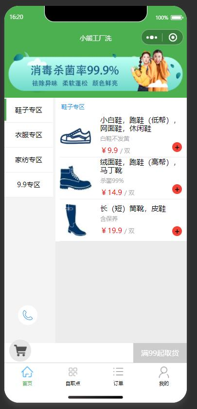
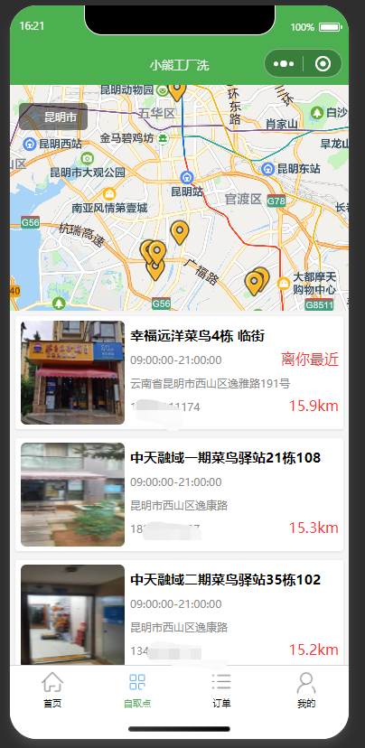
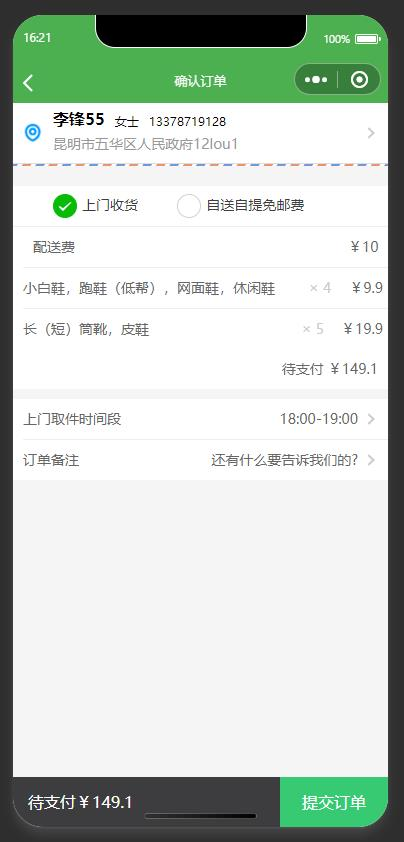

# 小熊洗护 微信小程序介绍

小熊洗鞋洗衣 介绍
一个 本地化洗鞋，洗衣服务的微信小程序，有加盟店，支持自送 或者快递，具有业务分销功能。

#### 软件架构
微信原生小程序，已经在使用

#### 安装教程

1.  克隆到本地
2.  微信小程序开发工具直接打开运行
3.  接口可以使用我的，在开发工具设置不校验合法域名，（用于学习）

#### 使用说明

1.  
2.  
3.  
4.
5.
6

#### 参与贡献

1.  Fork 本仓库
2.  新建 Feat_xxx 分支
3.  提交代码
4.  新建 Pull Request

#### 特技

1.  使用 Readme\_XXX.md 来支持不同的语言，例如 Readme\_en.md, Readme\_zh.md
2.  Gitee 官方博客 [blog.gitee.com](https://blog.gitee.com)
3.  你可以 [https://gitee.com/explore](https://gitee.com/explore) 这个地址来了解 Gitee 上的优秀开源项目
4.  [GVP](https://gitee.com/gvp) 全称是 Gitee 最有价值开源项目，是综合评定出的优秀开源项目
5.  Gitee 官方提供的使用手册 [https://gitee.com/help](https://gitee.com/help)
6.  Gitee 封面人物是一档用来展示 Gitee 会员风采的栏目 [https://gitee.com/gitee-stars/](https://gitee.com/gitee-stars/)
